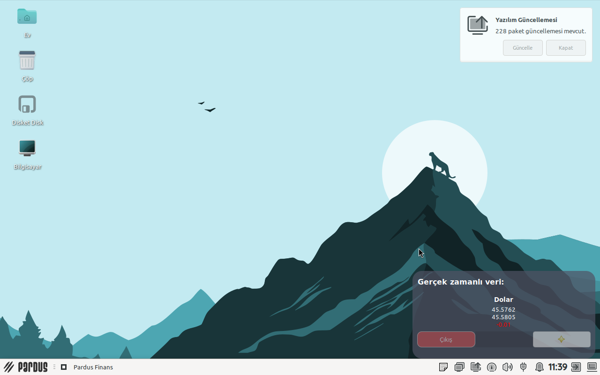
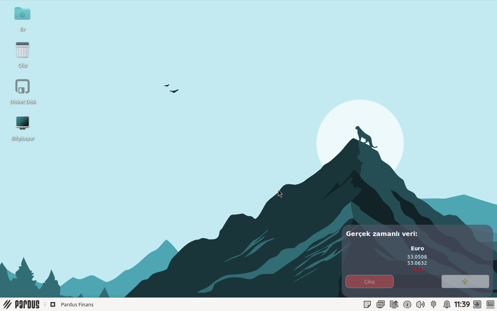
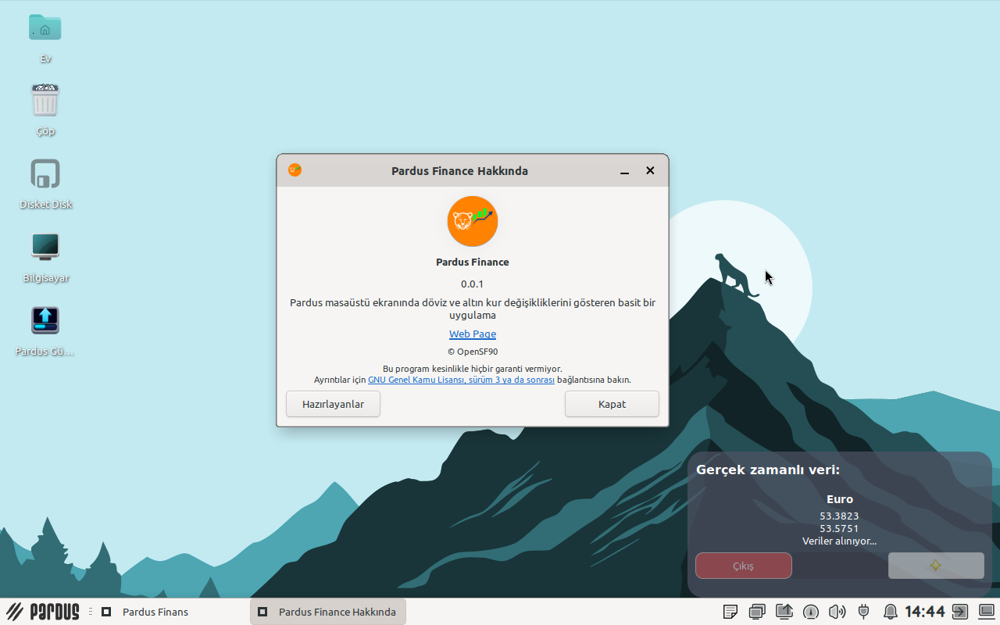

# pardus-finance
A simple application that displays currency and gold exchange rate changes on the Pardus desktop screen
This application obtains exchange rate data via the "https://api.genelpara.com/" service


Clone the repository
```bash
git clone https://github.com/heyderismayilli092/pardus-finance ~/pardus-finance
```

Run application
```bash
python3 ~/pardus-finance/src/main.py
```

### Build .deb package
```bash
sudo apt install devscripts git-buildpackage
sudo mk-build-deps -ir
gbp buildpackage --git-export-dir=/tmp/build/pardus-finance -us -uc
```

### **Screenshots**






NOTE: This software was prepared as part of the "Teknofest 2026 Pardus Bug Finding and Suggestion Competition"

